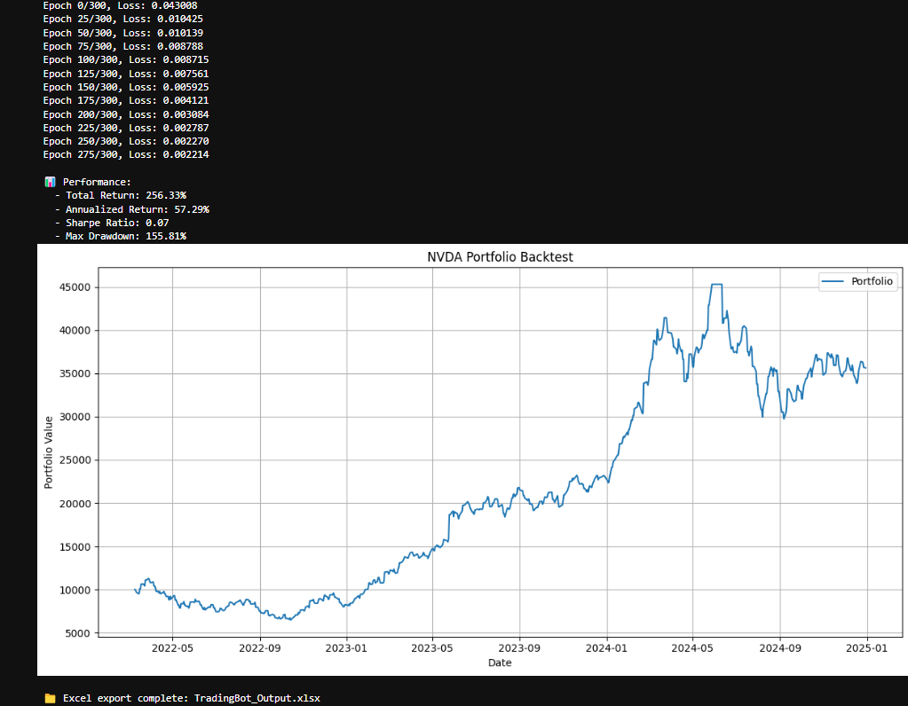

# Residual-Corrected Transformer Trading Bot

This project implements an advanced trading bot that combines:
- Kalman Filter smoothing
- Transformer-based residual forecasting
- Sentiment adjustment using financial news
- EMA-based trend confirmation
- Risk-managed trade execution

##  Project Structure
- config.py: API keys and constants.
- model.py: Transformer model with positional encoding.
- data_loader.py: Data fetching and technical indicators.
- trading_bot.py: Full trading bot class.
- run_backtest.py: Script for stock backtesting.
- run_paper_trade.py: Script for live paper trading.

##  Quick Start
1. Install Python 3.8+ and install requirements:
   ```
   pip install -r requirements.txt
   ```

2. To run a backtest:
   ```
   python run_backtest.py
   ```

3. To run paper trading:
   ```
   python run_paper_trade.py
   ```

## Configuration
Update `config.py` with your API keys:
- ALPACA_API_KEY = "YOUR_ALPACA_API_KEY"
- ALPACA_SECRET_KEY = "YOUR_ALPACA_SECRET_KEY"
- ALPHA_VANTAGE_API_KEY = "YOUR_ALPHA_VANTAGE_API_KEY"
- FMP_API_KEY = "YOUR_FMP_API_KEY"

## Sample Output



